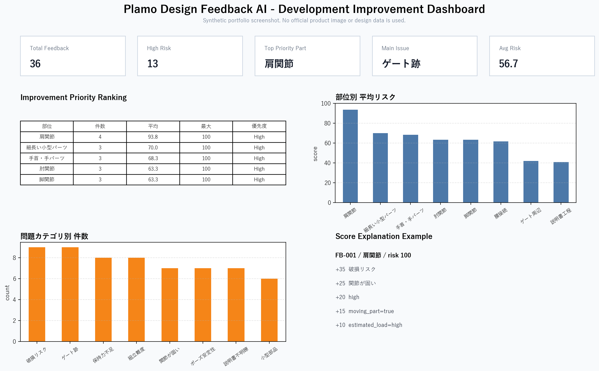
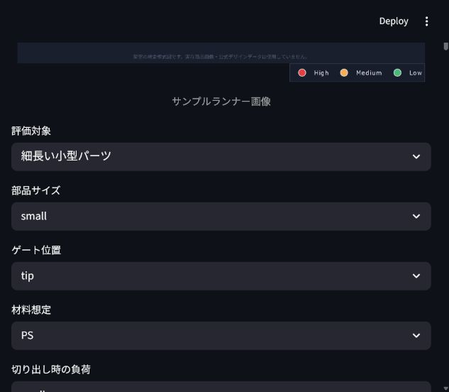
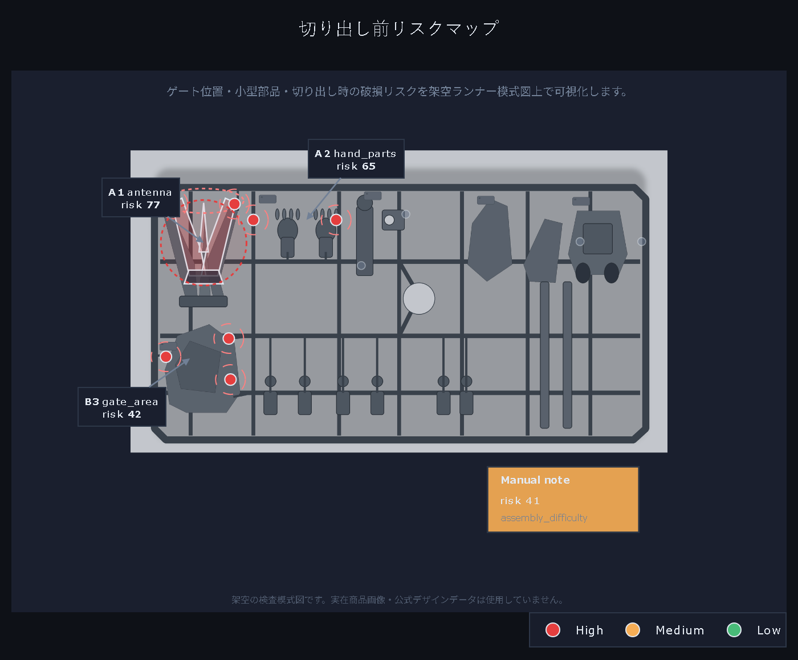
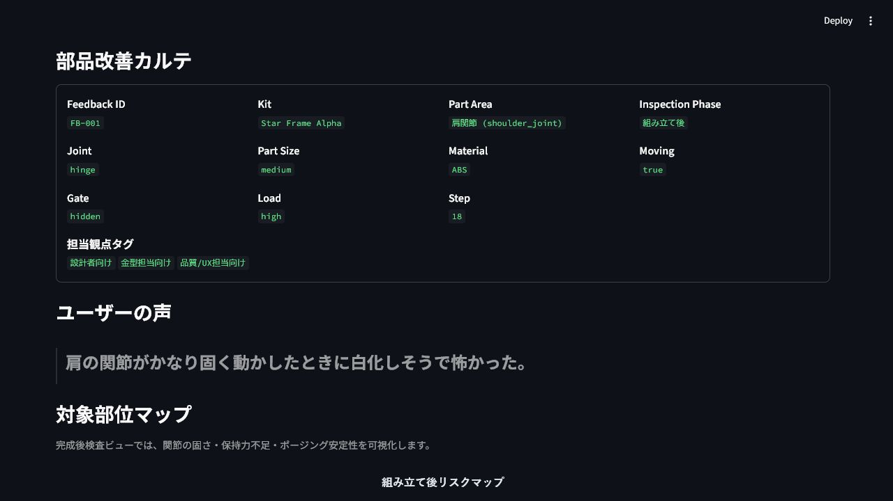
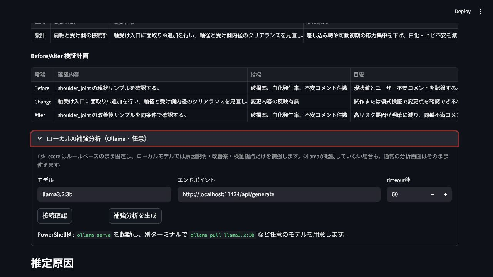

# Plamo Design Feedback AI

このアプリは、ランナー画像または架空の部品特徴データを入力し、切り出し前に壊れやすそうな部位、ゲート跡が目立ちそうな箇所、改善優先度を評価する開発改善支援プロトタイプです。

プラモデルのランナー状態のフィードバック文や、画像を見て入力した部品特徴を分析し、問題カテゴリ、対象部位、リスクスコア、原因候補、具体的な変更案、検証方法を表示するStreamlit製の小規模プロトタイプです。

> Status: Portfolio MVP
>
> 本プロジェクトは、公式データは使用していない学習用プロトタイプです。実在する企業・商品・キャラクター・公式画像・公式デザイン・実際の金型データは使用していません。

## このポートフォリオで示すこと

- 単なる感情分析ではなく、ユーザーの声と部品特徴を結びつけて改善優先度を出すこと
- ランナー画像や部品特徴から、ゲート位置、細い部品、小型部品、説明書上の注意点を評価できること
- ルールベースで説明可能なMVPを作り、後からLLM、CADデータ、試作レビュー、不具合報告へ拡張できる構成にすること
- AIを玩具そのものに入れるだけでなく、商品開発、品質改善、説明書改善の支援に使う発想
- 架空データと自作生成画像だけでデモを成立させ、著作権、商標、機密情報に配慮すること

## サンプル画面

以下は架空データから生成したダッシュボード画面イメージです。実在商品画像、公式画像、実際の設計データは使用していません。



現在のStreamlit画面では、サマリーカードの直後にランナー画像・特徴データ入力評価を配置し、画像や試作写真から読み取った特徴を入力して評価する流れを主役にしています。



検査画像は、架空ランナー模式図としてアプリ内で生成しています。



| 部品改善カルテ | ローカルAI補強分析 |
| --- | --- |
|  |  |

> 現在の画像はデモ説明用の仮素材です。今後、権利処理済みのランナー写真や試作サンプル写真を用意できる場合は差し替えます。現MVPでは画像そのものを自動認識するのではなく、画像から読み取った部品特徴を入力し、ルールベースで評価します。

## プロジェクト概要

`data/sample_feedback.csv` に含まれる架空のプラモデルレビューを読み込み、ルールベースで以下を分析します。

- 壊れやすい構造
- 組み立てづらい箇所
- 保持力不足
- ゲート跡の目立ちやすさ
- 説明書の分かりにくさ
- 検査フェーズ別のリスク
- 部品特徴を踏まえたリスクスコア
- リスクスコアの根拠
- 改善優先度ランキング
- 部位別の平均リスク
- ランナー画像・特徴データ入力による切り出し前リスク評価
- 架空ランナー上の部位別リスクマップ
- 選択フィードバックの対象部位ハイライト
- 生成済みランナー画像をもとにした画像ベース評価
- 改善案レポート

単にレビューを分類するだけでなく、「どの部位にどのようなリスクが集まっているか」「部品サイズ、材料、ゲート位置、可動部、荷重などの設計特徴とユーザーの声がどう結びつくか」「設計、金型、説明書、ユーザー体験のどこを見直すべきか」まで整理することを目的にしています。

現在の画面では、切り出し前のランナー状態を主対象にしています。CSV上には組み立て後レビューも残していますが、ポートフォリオとしての主訴求は「ランナー画像/部品特徴を入力すると、切り出し前リスクと改善案が返る」流れです。

## ポートフォリオとして伝えたいこと

このリポジトリは、玩具・プラモデル開発に対してAIやデータ分析をどう応用できるかを示すためのMVPです。

- ユーザーの自由記述を構造化し、改善検討に使える情報へ変換する発想
- 壊れやすさ、組み立てづらさ、保持力不足などを設計特徴と合わせてリスクとして優先度付けする設計
- ルールベース実装から始め、将来的にLLMや機械学習へ差し替えられる構成
- 著作権、商標、機密情報に配慮し、架空データだけでデモを成立させる姿勢
- AIを玩具そのものに入れるだけでなく、商品開発・品質改善に使う発想

## 作成背景

プラモデルは完成品を買うだけでなく、組み立てる過程そのものが体験価値になる。一方で、関節が固い、細いパーツが折れやすい、保持力が弱い、説明書が分かりにくいといった不満は、ユーザー体験に影響する。本プロトタイプでは、ユーザーフィードバックをAI風に分類し、設計・金型・説明書・ユーザー体験の改善につなげる仕組みを試作した。

## AI活用の意図

基本の分析は外部LLM APIを使わず、キーワードベースとルールベースで分類しています。これは、最初から大きなAIシステムを作るのではなく、入力、分類、スコアリング、改善案生成、レポート化という一連の流れをローカルで検証できるようにするためです。ルールベース分類には限界があるため、否定表現の一部を抑制しつつ、将来的にはLLMで分類候補や原因候補を補強する設計を想定しています。

将来的にLLMを組み込む場合も、現在の関数インターフェースを保つことで、UIやレポート生成部分を大きく変えずに分類器だけを置き換えられます。

このプロトタイプが扱うAI活用は、玩具本体にAI機能を入れる方向ではなく、商品開発プロセスを支援する方向です。ユーザーの声、部品特徴、試作レビュー、不具合報告を結びつけることで、設計・品質・説明書改善の意思決定を補助することを想定しています。

## Local LLM / Ollama 補強分析

詳細分析画面では、任意でローカルLLMによる補強分析を実行できます。外部APIへデータを送らず、ローカル環境のOllamaに対して、原因説明、追加の改善仮説、検証観点だけを生成させる設計です。

重要な方針:

- `risk_score` はルールベースのまま固定し、LLMには再採点させません。
- LLMは説明文、改善案、検証方法の補強に限定します。
- Ollamaが起動していない環境でも、通常のCSV分析、リスクマップ、レポート生成は動きます。
- 実在商品名、公式データ、実際の金型データはプロンプトに含めない前提です。

PowerShell例:

```powershell
ollama serve
ollama pull llama3.2:3b
streamlit run app.py
```

必要に応じて環境変数でモデルやエンドポイントを変えられます。

```powershell
$env:LOCAL_LLM_ENDPOINT="http://localhost:11434/api/generate"
$env:LOCAL_LLM_MODEL="llama3.2:3b"
$env:LOCAL_LLM_TIMEOUT="60"
```

この機能は、AIを玩具そのものに入れるのではなく、機密を外部へ出さずに商品開発・品質改善レビューを支援するための拡張です。

## ユーザー体験改善への応用

ユーザーの不満は、設計や説明書の改善につながる重要な観察データです。このアプリでは、自由記述のレビューを以下のように開発改善へつなげます。

| ユーザーの声 | 分析結果 | 改善につながる観点 |
| --- | --- | --- |
| 関節が固く白化しそう | `tight_joint`, `breakage_risk` | 軸径、クリアランス、可動負荷 |
| 細い部品が折れそう | `small_parts`, `breakage_risk` | 根元補強、ランナー配置、切り出し順序 |
| ポーズを取ると傾く | `loose_joint`, `posing_stability` | 保持力、重心、接続形状 |
| 説明書で左右を迷う | `instruction_unclear`, `assembly_difficulty` | 拡大図、注意アイコン、工程設計 |
| ゲート跡が目立つ | `gate_mark` | ゲート位置、外観面、処理しやすさ |

さらに、CSVに含まれる `part_size`、`material_type`、`moving_part`、`gate_position`、`estimated_load` などの架空の部品特徴を使い、自由記述だけでは見落としやすい設計上のリスク要因をスコアへ反映します。

## 想定ユースケース

- 架空レビューを使った製品改善アイデアのデモ
- ユーザーの不満をカテゴリ別に集計する学習用サンプル
- 設計、金型、説明書、ユーザー体験の観点を横断した改善案の整理
- 将来的にLLMや機械学習へ置き換える前のMVP検証

## 主な機能

- ランナー画像または試作写真を入力し、部品特徴を指定して評価する入力フォーム
- 入力した部品特徴から、切り出し前の破損・ゲート跡・小型部品リスクを即時評価
- なぜそのリスクスコアになったかを示すスコア内訳表示
- 設計、金型、説明書、ユーザー体験の観点で「どこをどう変えるか」を出す具体案テーブル
- 開発改善ダッシュボードのサマリーカード
- 部位ごとの改善優先度ランキング
- 部位別平均リスクスコアの棒グラフ
- 問題カテゴリ別件数の棒グラフ
- サンプルCSVの読み込みと表示
- フィードバックごとの問題カテゴリ分類
- 部位検出、重要度判定、原因候補の出力
- 問題カテゴリ、重要度、部品特徴を使った0から100のリスクスコア算出
- 検査フェーズ別の表示切り替え
- 架空ランナー模式図による切り出し前リスクマップ
- 選択フィードバックの対象部位、ゲート位置、具体的な変更案の可視化
- ランナー画像ベース評価による、ゲート位置・小型部品・切り出しリスクの整理
- 任意フィードバックをその場で分析できるデモ入力欄
- 任意のローカルLLM/Ollama補強分析
- リスク上位5件の表示
- 選択フィードバックの詳細分析
- Markdown形式の改善案レポート生成
- `outputs/improvement_report.md` への保存
- `outputs/image_based_analysis.md` への保存
- `unittest` による分類、スコアリング、データフローのテスト

## 使用技術

- Python 3.11以上
- Streamlit
- pandas
- matplotlib
- Plotly
- Kaleido
- Ollama対応ローカルLLM（任意）

外部LLM API、実在レビュー、公式データは使用していません。

## 技術的工夫

- `feedback_analyzer.py`、`risk_scorer.py`、`improvement_generator.py` を分離し、分類、スコアリング、改善案生成の責務を明確にしました。
- `part_visualizer.py` で架空ランナー模式図をPlotlyで描画し、対象部位、ゲート位置、細い部位を視覚的に確認できるようにしました。
- ランナー検査ビューでは、実在商品ではないオリジナル生成画像 `assets/runner_bg_realistic.png` を背景に使い、写真らしいランナー上へリスクマーカーを重ねています。
- ランナー画像・特徴データ入力評価では、画像を見て指定した部品サイズ、ゲート位置、材料、切り出し時の負荷、観察特徴を既存のリスクスコアリングへ流し込みます。
- `image_based_analyzer.py` で、生成済みランナー画像に含まれる部品番号、ゲート点、リスク色、検査ラベルを再整理し、画像を見ながら説明できる分析コメントを生成します。現段階では実画像認識ではなく、アプリが描画した検査点を構造化して読み解く実装です。
- `analyze_feedback(feedback_text)` の入出力を辞書形式に固定し、将来的にLLM APIや機械学習モデルへ差し替えやすくしました。
- `schemas.py` に `TypedDict` と行単位警告用の dataclass を置き、主要な分析レコードのスキーマを明示しました。
- 「折れにくい」「固くない」「ゲート跡が目立たない」などの否定表現を一部抑制し、単純なキーワード一致による過剰検出を減らしました。
- リスクスコアはカテゴリ重み、重要度、部品特徴を合算する単純なルールにし、なぜ高リスクになったか説明しやすくしました。
- スコアリング方針は [docs/scoring_policy.md](docs/scoring_policy.md) に切り出し、実務適用時にどのデータで校正すべきかを明記しました。
- スコアの検証方法とLLM/CAD連携の拡張設計は [docs/validation_and_extension_plan.md](docs/validation_and_extension_plan.md) に整理しました。
- 部品特徴として、ジョイント種別、部品サイズ、材料、可動部かどうか、ゲート位置、想定荷重、組み立て工程を扱います。
- 詳細分析では、問題カテゴリ、重要度、部品特徴加点を表で表示し、評価理由を説明可能にしています。
- 改善案は設計、金型、説明書、ユーザー体験の4視点に分け、単なる感情分析で終わらないようにしました。
- 検査フェーズは `runner_state` を主対象にし、ランナー検査と組み立て後レビューの観点を混同しないようにしました。
- CSV読み込み失敗時はStreamlit上にエラーメッセージを表示します。
- CSVの一部行だけが不正な場合は、該当行をスキップし、警告として表示します。
- GitHub Actionsでコンパイル、単体テスト、Streamlitスモークテスト、README用画像生成を自動実行します。
- UTF-8前提で日本語データを扱います。
- matplotlibの日本語フォントが環境にない場合でも、最低限グラフが表示されるようにしています。
- 生成レポートをMarkdownとして保存できるため、GitHub上でも内容を確認しやすくしています。

## ディレクトリ構成

```text
plamo-design-feedback-ai/
  app.py
  feedback_analyzer.py
  risk_scorer.py
  improvement_generator.py
  image_based_analyzer.py
  llm_adapter.py
  part_visualizer.py
  schemas.py
  requirements.txt
  README.md
  .github/
    workflows/
      ci.yml
  assets/
    runner_bg_realistic.png
    runner_sample.png
  data/
    sample_feedback.csv
  outputs/
    .gitkeep
    image_based_analysis.md  # アプリ操作で生成
    improvement_report.md    # アプリ操作で生成
  docs/
    concept.md
    scoring_policy.md
    validation_and_extension_plan.md
    portfolio_review.md
    screenshots/
      dashboard.png
      detail_carte.png
      local_llm_panel.png
      risk_map_runner_view.png
  scripts/
    generate_portfolio_assets.py
  tests/
    test_actionable_fix_plan.py
    test_app_dataflow.py
    test_feedback_analyzer.py
    test_image_based_analyzer.py
    test_part_visualizer.py
    test_risk_scorer.py
```

## セットアップ方法

PowerShellで以下を実行します。

```powershell
python -m venv .venv
.\.venv\Scripts\Activate.ps1
pip install -r requirements.txt
```

## 実行方法

```powershell
streamlit run app.py
```

ブラウザでStreamlitのURLを開くと、最初にランナー画像・特徴データ入力評価が表示されます。サンプルCSVと全件分析結果は、根拠データとして折りたたみ内で確認できます。

## Streamlit Community Cloudで公開する場合

Streamlit Community Cloudのワークスペースで新規アプリを作成し、以下を指定します。

- Repository: `kur11208/plamo-design-feedback-ai`
- Branch: `main`
- Main file path: `app.py`
- App URL: `plamo-design-feedback-ai`（空いていない場合は任意の短い名前）
- Secrets: 不要

公式データや外部LLM APIは使っていないため、追加の環境変数なしで起動できます。

## テスト方法

```powershell
python -m unittest discover -s tests
```

GitHub Actionsでは、`python -m compileall .`、`python -m unittest discover -s tests`、Streamlit AppTestによる起動スモークテスト、`python scripts/generate_portfolio_assets.py` による画像生成確認を実行します。

README用の架空スクリーンショット、検査画像、画像ベース再分析レポートを再生成する場合は以下を実行します。

```powershell
python scripts\generate_portfolio_assets.py
```

## サンプル画面の説明

- 開発改善ダッシュボード: 総件数、高リスク件数、最優先改善部位、最多問題カテゴリ、平均リスクスコアを表示します。
- ランナー画像・特徴データ入力評価: ランナー写真や模式図を入力し、部品サイズ、ゲート位置、切り出し時の負荷などを指定すると、リスクスコア、原因候補、具体的な変更案が返ります。
- 改善優先度ランキング: 部位ごとに件数、平均リスク、最大リスク、主要カテゴリ、優先度を表示します。
- 部位別リスクグラフ: `part_area` ごとの平均リスクスコアを比較します。
- カテゴリ別グラフ: `breakage_risk` や `loose_joint` などの出現件数を表示します。
- サンプルCSVと分類結果: 架空キット、架空フィードバック、分析後の問題カテゴリ、検出部位、リスクスコア、部品特徴、原因候補を折りたたみ内で確認できます。
- 任意フィードバック分析デモ: 面接や説明時に、その場でレビュー文と部品特徴を入力して分析できます。
- ランナー検査ビュー: 外枠、枝分かれしたランナー棒、不規則な部品形状、ゲート接続点、部品番号を描き、切り出し前の破損・ゲート跡リスクを表示します。
- リスク上位5件: 改善優先度が高いフィードバックを抽出します。
- 詳細分析: 選択した1件を「部品改善カルテ」として表示し、部品特徴、ユーザーの声、リスク理由、推定原因、具体的変更案、検証方法を確認できます。
- スコア根拠表: 問題カテゴリ、重要度、部品特徴による加点を表示し、なぜ高リスクになったかを確認できます。
- 対象部位マップ: ランナー上の対象部品やゲート位置を強調表示します。
- 画像ベース評価: 現在のランナー画像を見たときに、どの部品・ゲートが優先確認対象になるかを表とMarkdownで整理します。
- 改善案レポート: Markdown形式で集計結果と上位リスクの改善案を生成します。

## 今後の改善案

- フィードバック件数を増やし、分類ルールとスコア重みの妥当性を検証する
- 類似表現や複雑な否定表現に強い自然言語処理を追加する
- LLM APIを使って原因候補と改善案をより柔軟に生成する
- 実際の画像解析へ拡張し、権利処理済みのランナー写真や試作サンプル写真からゲート位置、細い部位、白化、破損痕跡を検出する
- CADデータや部品寸法、公差情報と連携して設計特徴をより精密に扱う
- 試作レビューや実際の不具合報告と連携して改善優先度を検証する
- レビュー時期、ユーザーレベル、組み立て時間などを加えた分析を行う
- 改善前後のリスクスコアを比較し、施策効果を見える化する
- 実製品に応用する場合は、権利と機密に配慮した正式なデータ利用手順を整備する

## 注意事項

本プロジェクトは学習・ポートフォリオ用のプロトタイプです。実在する企業・商品・キャラクター・公式データ・実際の金型データは使用していません。サンプルデータはすべて架空のものです。
